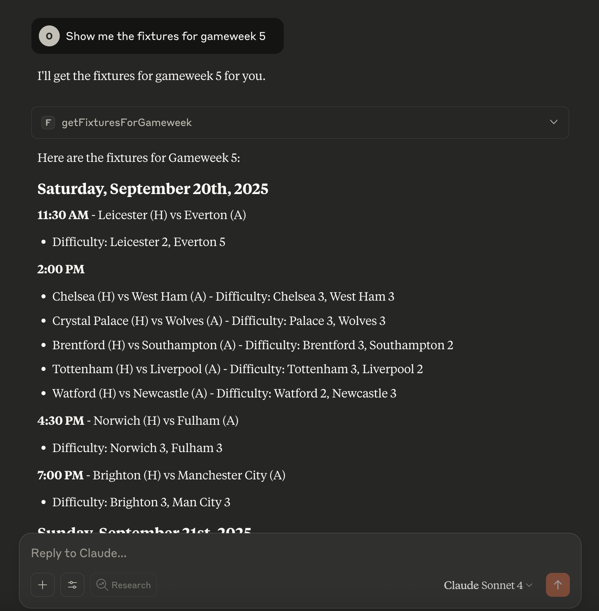

# FPL MCP Server

A Model Context Protocol (MCP) server for the Fantasy Premier League API.

## Installation

### Install from NPM (Recommended)

```sh
npm install -g fpl-mcp
```

### Install from Source

```sh
git clone https://github.com/owen-lacey/fpl-mcp.git
cd fpl-mcp
npm install
npm run build
```

## Quick Start

### Using with Claude Desktop

If installed via NPM, add this to your `claude_desktop_config.json`:

```json
{
  "mcpServers": {
    "fpl-api": {
      "command": "npx",
      "args": ["fpl-mcp"]
    }
  }
}
```

If installed from source, use:

```json
{
  "mcpServers": {
    "fpl-api": {
      "command": "node",
      "args": ["/path/to/fpl-mcp/build/src/server.js"]
    }
  }
}
```

### Inspect the MCP tools
Use the Model Inspector to explore available tools:
```sh
npx @modelcontextprotocol/inspector npx fpl-mcp
```

## Usage Example

You can connect this MCP server to Claude Desktop and interact with FPL data using natural language.



---

## Endpoints Supported
See `docs/fpl-api-cheatsheet.md` for all FPL API endpoints exposed as MCP tools.


---

## Example Prompts

Use these prompts to interact with the MCP server via your LLM:

- "Show me the fixtures for gameweek 5."
- "How am I doing in my private leagues (team id is 12345)?"
- "How did mo salah get on in GW1?"

You can ask natural language questions about any supported endpoint. The LLM will use the appropriate MCP tool to fetch the data.

---

## License
MIT

